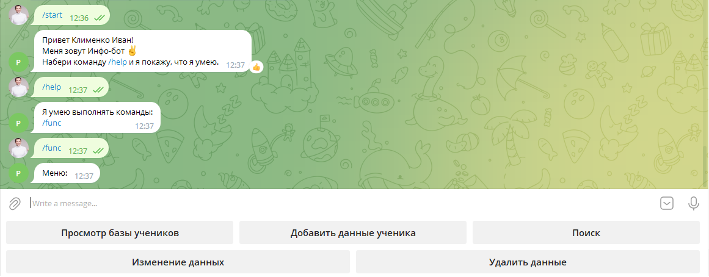
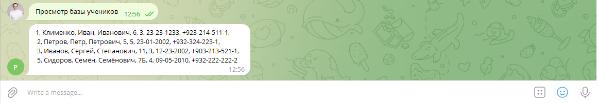
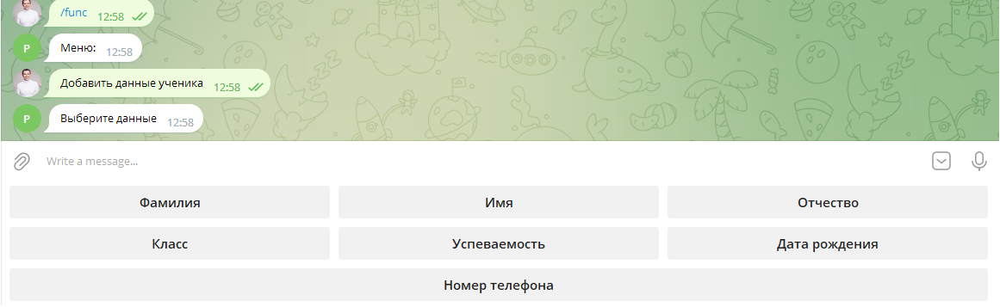
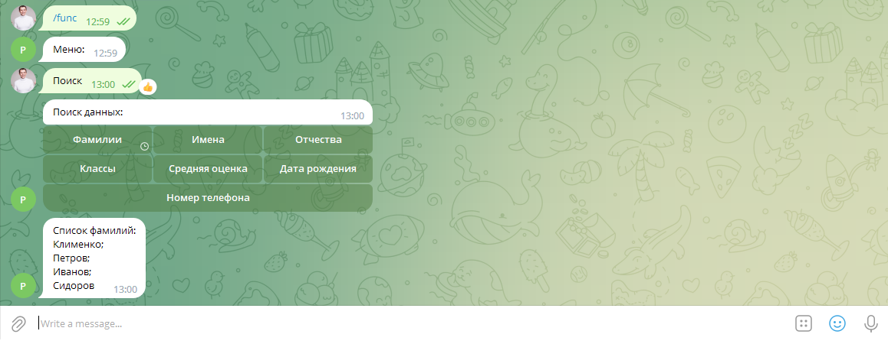
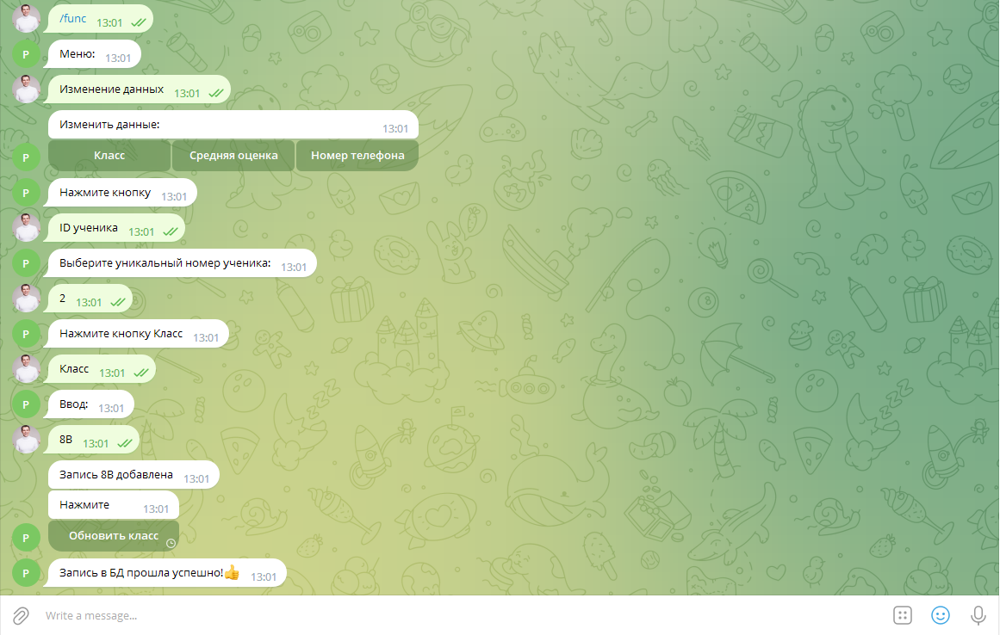
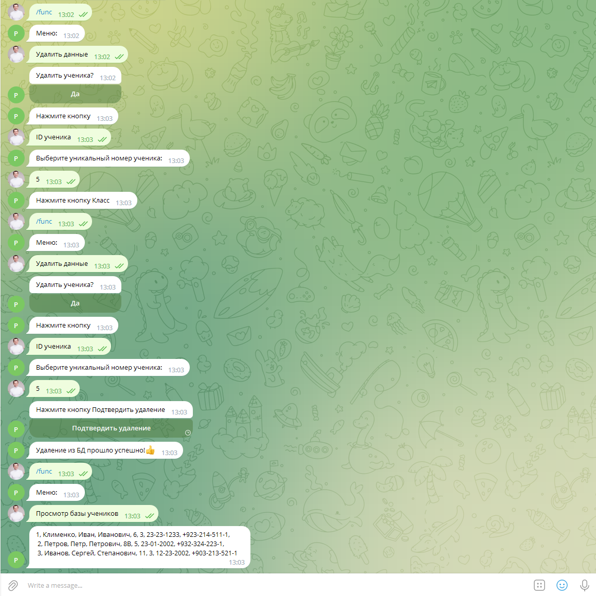

# Телеграмм-бот - БД "Ученики"
Проект реализован на базе библиотеки **telebot**. Бот создан для работы с информационной системой - "Ученики". Данные сохраняются в базу данных **SQlite**

### Разработчик: Клименко Иван
---
Блок-схема функционирования.

---

**Возможные операции:**
+ Вывод информации из БД(база данных)
+ Добавление информации в БД
+ Поиск информации в БД
+ Изменения данных в БД
+ Удаление информации из БД
---
Описание архитектуры:
+ **main** - точка входа в программу. Выполняет запуск программы.
+ **bd_students** - модуль базы данных. Создаёт базу данных. В модуле реализованы простые запросы от пользователя.
---

**Инструкции пользователям**

[Cсылка на бот в телеграмме](http://t.me/PGU235Bot)  

+ Для запуска программы на главном экране необходимо ввести команду **/start** 
+ Диалоговое меню позволяет использовать функции программы
    
+ Вывод информации из БД(база данных)
  
+ Добавление информации в БД
  
+ Поиск информации в БД
  
+ Изменения данных в БД
  
+ Удаление информации из БД
  