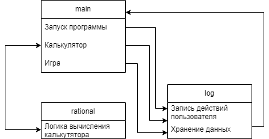
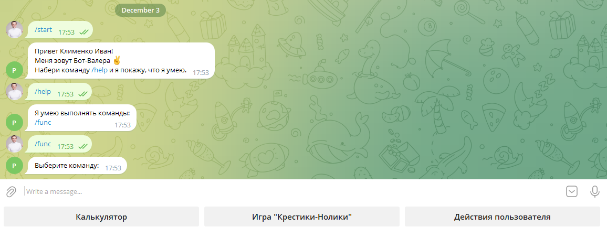
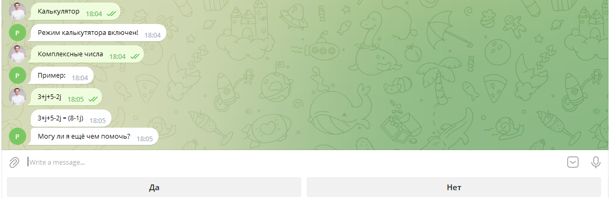
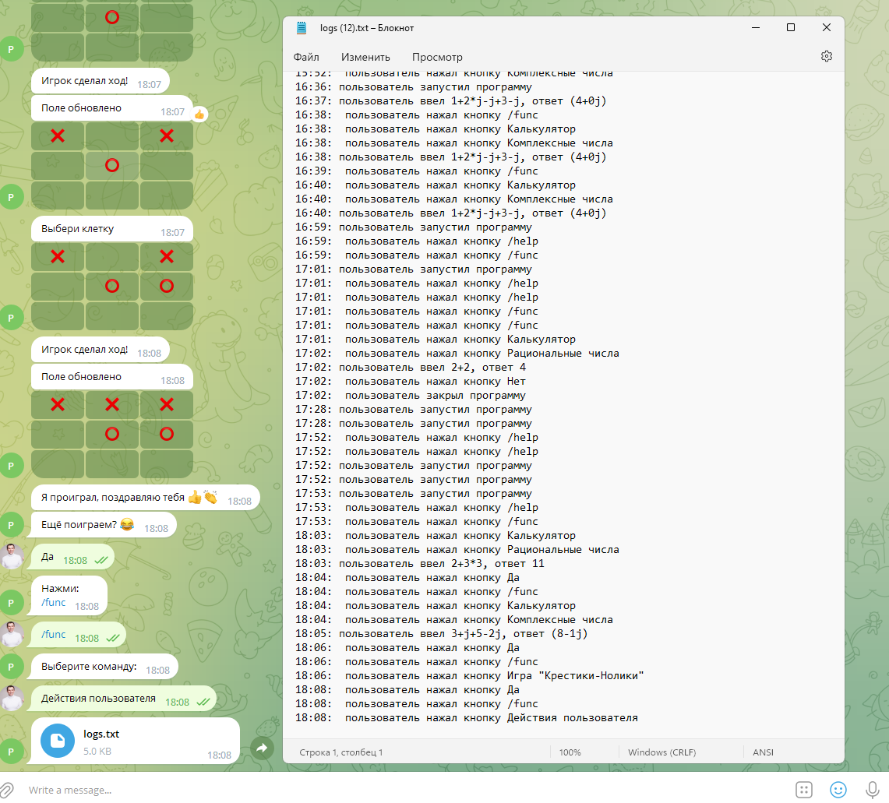
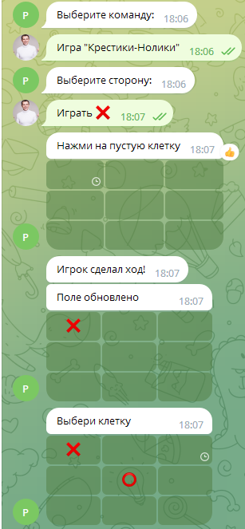

# Телеграмм-бот
Проект реализован на базе библиотеки **telebot**. Бот имеент несколько функций: **калькулятор** и игра в **"Крестики-Нолики"**. Действия пользователя сохраняются в отдельный файл.

### Разработчик: Клименко Иван
---
Блок-схема функционирования.

---

**Возможные операции:**
+ Сложение
+ Вычитание
+ Умножение
+ Деление
+ Выражения со скобками
+ Вычисление комплексных чесел
---
Описание архитектуры:
+ **main** - точка входа в программу. Выполняет запуск программы.
+ **rational** - логика простого калькулятора с функцией сохранения приоритета вычислений
+ **log** - модуль логирования. Записывает в файл logs.txt историю действий пользователя и примеры ввода и результаты вычислений.
---

**Инструкции пользователям**

[Cсылка на бот в телеграмме](http://t.me/PGU235Bot)  

+ Для запуска программы на главном экране необходимо ввести команду **/start** 
    
+ Калькутор - имеет два режима использования с рациональными числами и комплексными
  
+ Действия пользователя - выводит на экран файл логами.
  
+ Игра "Крестики-Нолики" - классическая игра. Встроена функция выбора стороны.
  